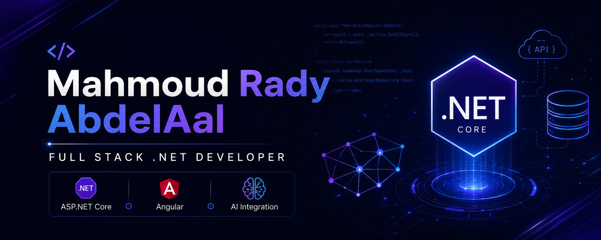

  

<h1 align="center">Hi 👋, I'm Mahmoud Rady AbdelAal</h1>

<h3 align="center">
ASP.NET Core & Angular Developer building scalable APIs, AI-powered systems, and modern web applications.
</h3>

I specialize in backend engineering, REST APIs, AI integrations, and scalable software architecture using ASP.NET Core, Angular, SQL Server, and modern development practices.

---

## 🚀 About Me

- 💻 Full Stack .NET Developer focused on real-world web applications
- 🧠 Interested in AI integrations, RAG systems, and smart assistants
- 🏗️ I work with Clean Architecture, Web APIs, SQL Server, and Angular
- 🎯 Goal: Build scalable, maintainable, and production-ready software
- 🌍 Open to freelance projects, internships, remote jobs, and full-time roles

---

# 🛠️ Tech Stack

## Backend

---

## Architecture

---

## Frontend

---

## Database & ORM

---

## Authentication & Security

---

## AI & ML

---

## Dev Tools

---

# 🔥 Featured Projects

## 🏥 MedCore Smart Hospital System

Doctor & Patient Portal built with ASP.NET MVC / ASP.NET Core concepts, focusing on:
- Authentication & Authorization
- Doctor Dashboard
- Patient Dashboard
- Medical Workflows
- Responsive UI
- Clean Architecture Concepts

---

## 🤖 AI Lab

AI-powered experiments and integrations using:
- OpenAI APIs
- Prompt Engineering
- AI Conversations
- Image Generation
- Smart Assistants
- Backend AI Workflows

---

## 🏠 AI Interior Design System

A smart interior design platform featuring:
- Projects & Iterations
- Product Catalog
- JWT Authentication
- AI-based Workflow
- Clean Architecture
- Scalable Backend APIs

---

## 📄 RAG Policy Search System

AI-powered document search system with:
- PDF Upload
- Text Extraction
- Chunking
- Embeddings
- Semantic Search
- AI Question Answering

---

## 💬 Real-Time Product Comment System

Real-time comments platform using:
- ASP.NET
- SQL Server
- SignalR
- Live Updates
- Product Interactions

---

# 📊 GitHub Stats

  

  

  

---

# 📫 Contact Me

  

  

  

  

---

  

